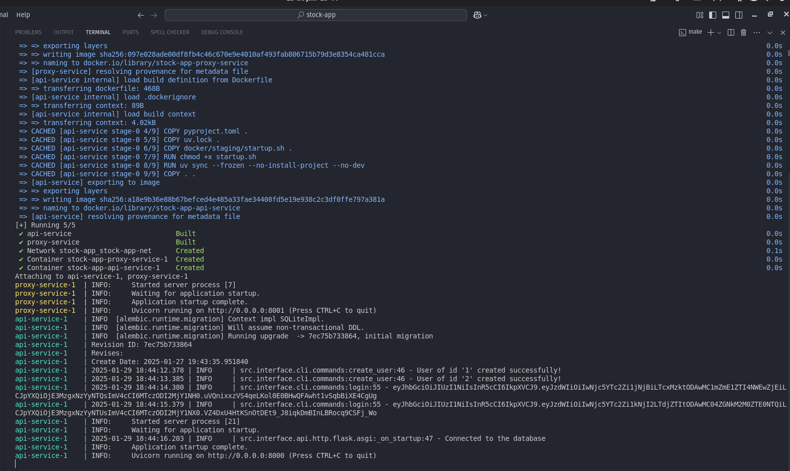
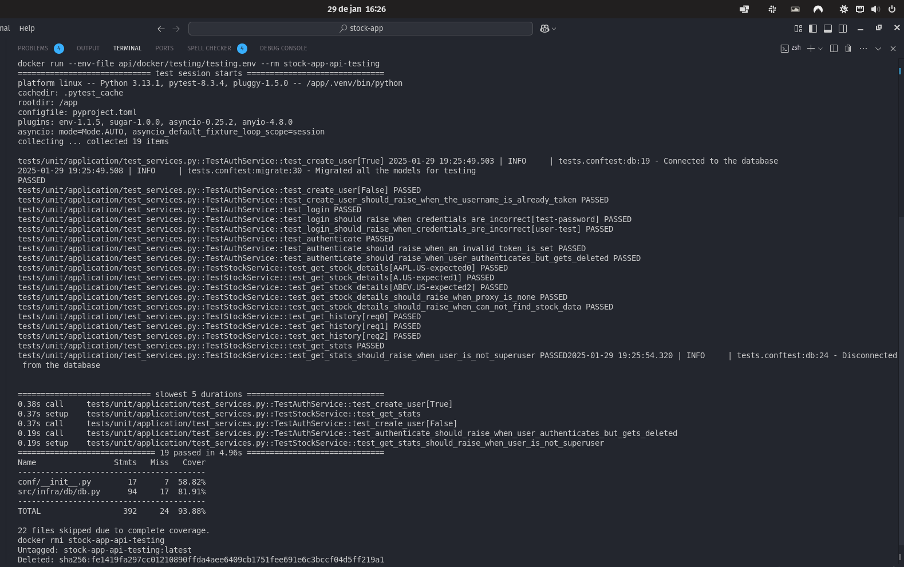

# Stock App

## Description

This repository contains two applications that when running together are able to
retrieve stocks from the [stooq api](https://stooq.com) and save the current
values in the database. It has a simple user authentication that uses JWT tokens and
the users can be managed via cli for now.

### Proxy Service

As the name implies, it's a simple proxy service that receives requests from the main
application and proxies those stock requests to the stooq api. It's a really small
application, contained in a single file. Since the application is meant to run
alongside the main application using docker compose on the same docker network, the
only external app that is able to access the proxy service is the main application,
which is the one that is user facing, therefore, eliminating the need of authentication
over there.

### API Service (User facing)

The main application, called api service, is the one that handles the user management,
user authentication, api calls to the proxy service and the business logic for the
challenge. Besides the command line functions, it basically exposes 3 endpoints, all
of them requiring authentication:

- **GET /api/v1/stock?q={stockCode}**

  This endpoint receives a stock code like `aapl.us` or `msft.us` and calls the proxy
  service and saves the response into the user's history of stock calls.

  This is how the response looks like:

  ```json
  {
    "symbol": "AAPL.US",
    "company_name": "APPLE",
    "quote": 123
  }
  ```

- **GET /api/v1/history**

  This endpoint returns all of the stocks that were requested by the user that is
  currently authenticated.

  This is how the response looks like:

  ```json
  [
    {
      "date": "2021-04-01 19:20:30",
      "name": "APPLE",
      "symbol": "AAPL.US",
      "open": "123.66",
      "high": 123.66,
      "low": 122.49,
      "close": "123"
    },
    {
      "date": "2021-03-25 11:10:55",
      "name": "APPLE",
      "symbol": "AAPL.US",
      "open": "121.10",
      "high": 123.66,
      "low": 122,
      "close": "122"
    }
  ]
  ```

- **GET /api/v1/stats**

  This endpoint returns the top 5 most requested stocks for the entire application
  across all users. However, only superusers can access this endpoint.

  This is how the response looks like:

  ```json
  [
    { "stock": "aapl.us", "times_requested": 5 },
    { "stock": "msft.us", "times_requested": 2 }
  ]
  ```

This is the [website](https://stooq.com/t/?i=518) where you can encounter the list of
available stock codes:

## How to run the project

If you don't have it already, you need to install
[docker and docker compose](https://www.docker.com/) in order to run the project
locally or deploy it into the cloud.

Also, if you have the `make` command available in your system's PATH it would be of
great help to avoid typing down long commands, but it's optional.

### Running the server

To run the server locally, open up your terminal inside this project's directory and run
the following command:

```bash
$ docker compose up
```

Or this one if you have `make` installed

```bash
$ make up
```

Notice that once all of the services are built and its ready to accept requests, you
need to retrieve two jwt tokens that were automatically created. The first one is for
a user that does not have superuser permissions and the second token is for the user
that has superuser permissions. It will look like the screenshot bellow:



Copy and paste the tokens into your preferred http client and start calling the endpoints
documented above!

Once you are finished with the local and manual tests you can run the following command
to stop the server:

```bash
$ docker compose down
```

Or this one if you have `make` installed

```bash
$ make down
```

In addition, `make down` will also remove the images that were just built to avoid
occupying your machine's disk space.

### Running the tests

This project also contains automated tests using the pytest library, and similar to
how we ran the project locally, we will use docker to run the tests locally as well.

Run the following commands to see the test suite with code coverage:

```bash
# Builds the api service image
$ docker build -t stock-app-api-testing --file api/docker/testing/Dockerfile ./api

# Runs a container based off the newly built image
$ docker run --env-file api/docker/testing/testing.env --rm stock-app-api-testing

# Removes the newly created image from the docker's image list
$ docker rmi stock-app-api-testing
```

Or this one if you have `make installed`

```bash
$ make tests
```

You should see something like the screenshot bellow after you run the command:


